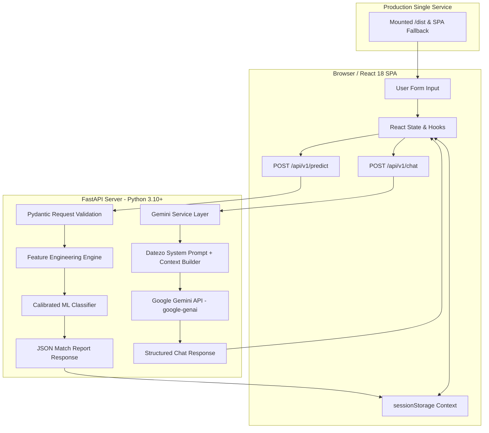

<div align="center">

# 💖 DATEZO — AI-Powered Speed Dating Match Prediction Platform

<p align="center">
  <strong><em>"Know Your Real Compatibility."</em></strong>
</p>

[](https://www.python.org/)
[](https://fastapi.tiangolo.com/)
[](https://reactjs.org/)
[](https://vitejs.dev/)
[](https://tailwindcss.com/)
[](https://ai.google.dev/)
[](LICENSE)

<br />

```
  ██████╗  █████╗ ████████╗███████╗███████╗██████╗ 
  ██╔══██╗██╔══██╗╚══██╔══╝██╔════╝╚══███╔╝██╔══██╗
  ██║  ██║███████║   ██║   █████╗    ███╔╝ ██║  ██║
  ██║  ██║██╔══██║   ██║   ██╔══╝   ███╔╝  ██║  ██║
  ██████╔╝██║  ██║   ██║   ███████╗███████╗██████╔╝
  ╚═════╝ ╚═╝  ╚═╝   ╚═╝   ╚══════╝╚══════╝╚═════╝ 
```

**Datezo** is a production-grade, full-stack AI/ML platform and web application engineered to predict mutual match outcomes in speed-dating scenarios. It transforms raw rating perceptions into 11 domain-engineered compatibility features, computes calibrated empirical match probabilities, derives a transparent 0–100 Compatibility Index, and provides natural-language AI explanations powered by **Google Gemini API**.

</div>

---

## 📑 Table of Contents

- [✨ Key Features](#-key-features)
- [🎨 Editorial Sticker Design System & Theme](#-editorial-sticker-design-system--theme)
- [🧠 Machine Learning & Feature Engineering Architecture](#-machine-learning--feature-engineering-architecture)
- [🤖 Datezo AI Chat System (Google Gemini API)](#-datezo-ai-chat-system-google-gemini-api)
- [🗺️ System Architecture Map](#-system-architecture-map)
- [📁 Directory & Codebase Structure](#-directory--codebase-structure)
- [⚡ Quick Start & Local Development](#-quick-start--local-development)
- [🚀 Render.com Unified Deployment Guide](#-rendercom-unified-deployment-guide)
- [🔌 API Endpoint Reference](#-api-endpoint-reference)
- [📚 18 In-Depth Knowledge Base Articles](#-18-in-depth-knowledge-base-articles)
- [🔒 Security & Data Privacy Architecture](#-security--data-privacy-architecture)
- [👤 Developer & Contact](#-developer--contact)

---

## ✨ Key Features

- **🎯 Machine Learning Match Predictor**: Binary classifier trained on speed-dating interaction data predicting mutual match likelihood (`0 = No Match`, `1 = Mutual Match`).
- **📊 Calibrated Match Probability (0–100%)**: Uses Sigmoid / Platt scaling across 5-Fold cross-validation splits to output true empirical match odds.
- **📈 Datezo Compatibility Index (0–100)**: A transparent multi-attribute utility score aggregating mutual attraction, shared hobbies, perception balance, preference alignment, and lifestyle.
- **💡 SHAP Signal Attribution**: Highlights specific positive and negative factors influencing every individual prediction.
- **💬 Datezo AI Chat Assistant**: Integrated conversational AI powered by Google's official `google-genai` SDK to answer user questions about their report in plain language.
- **📖 18 In-Depth Knowledge Base Articles**: Built-in library explaining feature engineering, model calibration, GroupKFold splits, SHAP values, and responsible AI ethics.
- **🎨 Warm Editorial Sticker-Card UI**: Handcrafted visual design system featuring pastel palettes, 1px/2px black borders, hard sticker shadows, and custom flat-vector SVG graphics.
- **📜 Legal & Documentation Suite**: Dedicated pages for System Documentation, API Specs, Privacy Policy, Terms of Service, and AI Disclaimer.

---

## 🎨 Editorial Sticker Design System & Theme

Datezo breaks away from generic dark SaaS dashboards by adopting a warm, playful, editorial, sticker-card design system inspired by modern vector illustrations.

### 🎨 Color Palette Tokens

| Token Name | Hex Code | Visual Sample | Application |
| :--- | :--- | :--- | :--- |
| **Base Canvas** | `#FFFBF8` | `` `#FFFBF8` | Primary background canvas |
| **Accent Coral** | `#F28B94` | `` `#F28B94` | Primary brand accent, main buttons, highlights |
| **Pastel Yellow** | `#FBECAF` | `` `#FBECAF` | Section 2 cards, code blocks, rating sliders |
| **Pastel Blue** | `#CDEFFB` | `` `#CDEFFB` | Section 1 cards, info banners, top nav tabs |
| **Pastel Green** | `#D7F3D3` | `` `#D7F3D3` | Section 3 cards, match badges, online status |
| **Pastel Lavender**| `#E7D9F5` | `` `#E7D9F5` | Section 4 cards, self-ratings, Gemini info |
| **Pastel Pink** | `#FFD5D8` | `` `#FFD5D8` | Closing CTA backgrounds, hero badges, user bubbles |
| **Ink Black** | `#1A1A1A` | `` `#1A1A1A` | Hard sticker borders, typography, card shadows |

> [!NOTE]
> All UI cards feature `border: 1px/2px solid #1A1A1A` and hard offset shadows (`box-shadow: 4px 4px 0px #1A1A1A` or `6px 6px 0px #1A1A1A`).

---

## 🧠 Machine Learning & Feature Engineering Architecture

### 1. 🧪 11 Core Domain Features

| Feature Identifier | Type | Computation / Description |
| :--- | :--- | :--- |
| `mutual_attractiveness` | Continuous (0–10) | `(attr_of_female + attr_of_male) / 2` |
| `mutual_sincerity` | Continuous (0–10) | `(sinc_of_female + sinc_of_male) / 2` |
| `mutual_intelligence` | Continuous (0–10) | `(intel_of_female + intel_of_male) / 2` |
| `mutual_fun` | Continuous (0–10) | `(fun_of_female + fun_of_male) / 2` |
| `mutual_ambition` | Continuous (0–10) | `(amb_of_female + amb_of_male) / 2` |
| `attr_gap` | Continuous (0–10) | `abs(attr_of_female - attr_of_male)` (Perception gap) |
| `intel_gap` | Continuous (0–10) | `abs(intel_of_female - intel_of_male)` (Intellect gap) |
| `shared_interests` | Continuous (0–10) | Direct rating of shared hobbies and pursuits |
| `pref_alignment_attr` | Continuous (0–100)| Alignment between stated attraction preferences and ratings |
| `pref_alignment_intel`| Continuous (0–100)| Alignment between stated intellect preferences and ratings |
| `lifestyle_similarity` | Categorical | Similarity band (`HIGH`, `MODERATE`, `LOW`) from going-out frequencies |

### 2. 🛡️ GroupKFold Cross-Validation & Calibration

> [!TIP]
> **Data Leakage Evasion**: Standard random K-Fold cross-validation leaks participant ratings across training and test splits. Datezo uses **5-Fold `GroupKFold`** grouped by participant ID (`male_id`), ensuring no individual dater appears in both training and test sets.

```
       RAW OUTPUT LOGITS             PLATT/SIGMOID SCALING           EMPIRICAL MATCH PROBABILITY
  ┌─────────────────────────┐      ┌───────────────────────┐      ┌──────────────────────────────┐
  │ Logit Score: +1.72      │ ───► │  p = 1 / (1 + e^-z)   │ ───► │ Calibrated Probability: 84.7%│
  └─────────────────────────┘      └───────────────────────┘      └──────────────────────────────┘
```

---

## 🤖 Datezo AI Chat System (Google Gemini API)

Datezo AI integrates Google's official **`google-genai`** SDK to act as an empathetic, conversational explanation layer.

> [!IMPORTANT]
> **Security Rule**: The `GEMINI_API_KEY` is maintained **strictly inside backend `.env` files**. It is NEVER exposed to React components, Vite `VITE_` variables, or browser network responses.

### 🔄 Context Injection Workflow

```
┌───────────────────────────┐      ┌───────────────────────────┐      ┌───────────────────────────┐
│ 1. Predict Form Submitted │ ───► │ 2. Results Rendered       │ ───► │ 3. Context Sent to Chat   │
│ Pair data sent to FastAPI │      │ Saved to sessionStorage   │      │ Formats report + 10 turns │
└───────────────────────────┘      └───────────────────────────┘      └─────────────┬─────────────┘
                                                                                    │
┌───────────────────────────┐      ┌───────────────────────────┐                    │
│ 5. Datezo AI Reply        │ ◄─── │ 4. Google Gemini API      │ ◄──────────────────┘
│ Streamed to React Chat UI │      │ System Instruction Applied│
└───────────────────────────┘      └───────────────────────────┘
```

---

## 🗺️ System Architecture Map



---

## 📁 Directory & Codebase Structure

```
Datezo/
├── .env                     # Local backend secrets (GEMINI_API_KEY, GEMINI_MODEL)
├── .env.example             # Template for backend configuration
├── .gitignore               # Excludes node_modules, .env, build output
├── api.py                   # Main FastAPI REST API & SPA static server
├── index.html               # Vite HTML entry point
├── package.json             # Frontend dependencies & scripts
├── requirements.txt         # Backend Python dependencies (FastAPI, uvicorn, scikit-learn, google-genai)
├── vite.config.js           # Vite build configuration & server proxies
│
├── src/
│   ├── App.jsx              # React Router setup & global providers
│   ├── main.jsx             # React DOM entry point
│   ├── index.css            # Tailwind CSS directives & sticker card tokens
│   │
│   ├── components/
│   │   ├── ArticleReaderModal.jsx  # Rich article reader modal overlay
│   │   ├── ClosingCTA.jsx          # Bottom conversion CTA section
│   │   ├── DeveloperContact.jsx    # Dedicated Shubham Pokale bio & contact sticker cards
│   │   ├── FeatureRow.jsx          # 3 core feature pillars
│   │   ├── Footer.jsx              # Footer links & copyright bar
│   │   ├── Header.jsx              # Page headers
│   │   ├── Hero.jsx                # Landing page hero section
│   │   ├── HowItWorks.jsx          # Step-by-step explainer section
│   │   ├── Navbar.jsx              # Sticky header navigation
│   │   ├── PairForm.jsx            # 4-Section interactive prediction form
│   │   ├── PredictionLoading.jsx   # Animated loading state during inference
│   │   ├── RatingSlider.jsx        # Custom styled input range slider
│   │   ├── ResultCard.jsx          # Compatibility report output card
│   │   ├── ScrollToTop.jsx         # Automatic top-scrolling router hook
│   │   ├── StickerCard.jsx         # Base sticker card container component
│   │   ├── Testimonial.jsx         # Social proof section
│   │   └── illustrations/
│   │       ├── CuteMascotGraphics.jsx  # Handcrafted cute vector mascots & stickers
│   │       ├── DatezoLogo.jsx          # SVG Datezo logo variants
│   │       ├── DecorativeShapes.jsx    # Underlines, starbursts, heart stickers
│   │       ├── DeveloperIllustration.jsx
│   │       ├── ExplainerAIIllustration.jsx
│   │       ├── HeroIllustration.jsx
│   │       └── PhoneMockupIllustration.jsx
│   │
│   ├── config/
│   │   └── developer.js    # Developer profile info & social media links
│   │
│   ├── data/
│   │   └── articles.js     # 18 full-text, readable Knowledge Base articles
│   │
│   ├── hooks/
│   │   └── usePrediction.js# Global prediction React state context hook
│   │
│   ├── pages/
│   │   ├── About.jsx       # About Datezo & Gemini API integration details
│   │   ├── ArticleDetail.jsx# Full article detail page (/blog/:slug)
│   │   ├── Blog.jsx        # Knowledge base library with search & category filters
│   │   ├── Chat.jsx        # Datezo AI Chat assistant page
│   │   ├── Documentation.jsx# System Docs, API reference, Privacy & Terms
│   │   ├── Home.jsx        # Complete editorial landing page
│   │   ├── Insights.jsx    # Score breakdown & calibration guide
│   │   ├── NotFound.jsx    # Custom 404 page
│   │   ├── Predict.jsx     # Prediction form page
│   │   └── Result.jsx      # Result report page
│   │
│   ├── services/
│   │   ├── api.js          # API service client connecting to FastAPI /predict
│   │   └── chatApi.js      # API service client connecting to FastAPI /chat
│   │
│   ├── gemini_service.py   # Google Gemini API Python service wrapper
│   ├── predict.py          # ML feature engineering & inference pipeline
│   └── train_pipeline.py   # GroupKFold model training script
```

---

## ⚡ Quick Start & Local Development

### Prerequisites
- **Node.js**: v18.0 or higher
- **Python**: v3.10 or higher
- **Gemini API Key**: Free key from [Google AI Studio](https://aistudio.google.com/)

### 1. Clone Repository
```bash
git clone https://github.com/shubham392007-sketch/Datezo.git
cd Datezo
```

### 2. Configure Backend Environment
Create `.env` file in the root directory:
```bash
cp .env.example .env
```
Add your Gemini API Key:
```env
GEMINI_API_KEY=your_google_gemini_api_key_here
GEMINI_MODEL=gemini-2.5-flash
```

### 3. Install Backend Dependencies & Start FastAPI Server
```bash
pip install -r requirements.txt
python api.py
```
*(Backend runs on `http://localhost:8000`)*

### 4. Install Frontend Dependencies & Start Vite Dev Server
```bash
npm install
npm run dev
```
*(Frontend runs on `http://localhost:5173`)*

---

## 🚀 Render.com Unified Deployment Guide

You can deploy the entire Datezo platform (React Frontend + FastAPI ML Engine + Gemini Chat) as a **SINGLE Web Service** on Render!

### Render Web Service Settings

- **Environment / Runtime**: `Python 3`
- **Build Command**:
  ```bash
  npm install && npm run build && pip install -r requirements.txt
  ```
- **Start Command**:
  ```bash
  uvicorn api:app --host 0.0.0.0 --port $PORT
  ```

### Environment Variables on Render:
- `GEMINI_API_KEY`: `your_gemini_api_key_here`
- `GEMINI_MODEL`: `gemini-2.5-flash`
- `PYTHON_VERSION`: `3.10.11`

---

## 🔌 API Endpoint Reference

### 1. `POST /api/v1/predict` — ML Match Inference

```json
// Request Body
{
  "male_age": 28,
  "female_age": 27,
  "same_race": 1,
  "same_field": 1,
  "shared_interests": 8.0,
  "attr_of_female": 8.5,
  "sinc_of_female": 8.0,
  "intel_of_female": 9.0,
  "fun_of_female": 8.5,
  "amb_of_female": 8.0,
  "attr_of_male": 8.0,
  "sinc_of_male": 8.5,
  "intel_of_male": 8.5,
  "fun_of_male": 8.0,
  "amb_of_male": 7.5,
  "male_pref_attr": 35.0,
  "male_pref_intel": 25.0,
  "female_pref_attr": 30.0,
  "female_pref_intel": 30.0,
  "male_self_attr": 8.0,
  "female_self_attr": 8.0,
  "male_goes_out": "often",
  "female_goes_out": "often"
}
```

```json
// Response Output
{
  "prediction": 1,
  "label": "MATCH",
  "match_probability": 84.7,
  "compatibility_category": "Very High Compatibility",
  "compatibility_index": 87.4,
  "positive_factors": [
    "High Mutual Attractiveness (8.25/10)",
    "Strong Shared Hobbies (8.00/10)",
    "Balanced Rating Perceptions"
  ],
  "negative_factors": [],
  "model_version": "1.0.0",
  "threshold_used": 0.30
}
```

### 2. `POST /api/v1/chat` — Datezo AI Conversational Endpoint

```json
// Request Body
{
  "message": "What does my match probability mean?",
  "conversation": [
    { "role": "user", "content": "Hi Datezo AI" },
    { "role": "assistant", "content": "Hello! How can I help explain your compatibility report?" }
  ],
  "prediction_context": {
    "prediction": 1,
    "match_probability": 84.7,
    "compatibility_index": 87.4
  }
}
```

---

## 📚 18 In-Depth Knowledge Base Articles

| Article Slug | Category | Topic Overview |
| :--- | :--- | :--- |
| `how-compatibility-scores-work` | `MODELING` | Feature engineering, mutual averages, & perception gap features |
| `what-does-84-percent-match-mean` | `CALIBRATION` | Raw logit confidence vs true calibrated empirical odds |
| `why-model-calibration-matters` | `AI ETHICS` | Overconfidence in machine learning & Platt scaling |
| `feature-engineering-for-speed-dating` | `FEATURE ENGINEERING` | Deep dive into 11 domain-specific compatibility signals |
| `attraction-vs-compatibility` | `PSYCHOLOGY` | Short-term attraction vs long-term relational chemistry |
| `group-kfold-cross-validation` | `DATA SCIENCE` | Preventing participant data leakage across training splits |
| `the-math-behind-datezo-index` | `MODELING` | Formula breakdown of multi-attribute 0–100 utility index |
| `scenario-a-vs-scenario-b` | `SYSTEM DESIGN` | Post-interaction rating datasets vs pre-date attraction |
| `shap-feature-importance-in-dating` | `AI ETHICS` | Game-theoretic feature attribution for transparent AI |
| `the-role-of-shared-interests` | `DATING INSIGHTS` | Statistical analysis of interest overlap in match choices |
| `age-gaps-and-match-odds` | `DATA SCIENCE` | Empirical findings from speed-dating demographic datasets |
| `cultural-and-academic-alignment` | `DATING INSIGHTS` | Homophily analysis in race and academic fields |
| `preference-versus-reality` | `PSYCHOLOGY` | What daters state in surveys vs what they choose in person |
| `lifestyle-similarity-in-dating` | `DATING INSIGHTS` | Going-out frequency alignment and relational friction |
| `avoiding-ai-soulmate-traps` | `AI ETHICS` | Responsible AI principles and avoiding false guarantees |
| `fastapi-and-scikit-learn-in-production` | `SYSTEM DESIGN` | Building sub-10ms serialized model inference APIs |
| `the-psychology-of-first-impressions` | `PSYCHOLOGY` | 4-Minute speed dating interactions and non-verbal cues |
| `future-of-ai-in-matchmaking` | `SYSTEM DESIGN` | Combining ML classifiers with LLM explanation agents |

---

## 🔒 Security & Data Privacy Architecture

> [!WARNING]
> **Responsible AI Disclaimer**: Datezo AI and Datezo predictions do not offer clinical therapy, medical diagnosis, or guaranteed marriage predictions. Datezo is an educational ML model evaluating post-interaction speed-dating ratings.

- [x] **Backend API Key Shielding**: `GEMINI_API_KEY` is loaded exclusively via Python `os.getenv` on FastAPI server.
- [x] **No Personal Data Selling**: Ratings processed strictly in-memory for inference. No tracking cookies or credential storage.
- [x] **CORS Protection**: Enforces origin restrictions in production.
- [x] **Transient Session Memory**: Session context stored in browser `sessionStorage`, auto-cleared on browser exit.

---

## 👤 Developer & Contact

Designed and developed with ❤️ by **Shubham Pokale**, an AI/ML engineering student passionate about building practical machine-learning products and intelligent web experiences.

- 🎓 **Role**: AI/ML Engineer & Developer
- 🌐 **GitHub**: [@shubham392007-sketch](https://github.com/shubham392007-sketch)
- 💼 **LinkedIn**: [Shubham Pokale](https://linkedin.com/in/shubham-pokale)
- 📸 **Instagram**: [@shubhamofficial_2007](https://instagram.com/shubhamofficial_2007)
- ✉️ **Email**: shubham392007@gmail.com
- 🐦 **X (Twitter)**: [@SHUBHAM392007](https://x.com/SHUBHAM392007)

---

<div align="center">
  <sub>© 2026 Datezo. Designed & Developed by Shubham Pokale. All rights reserved.</sub>
</div>
